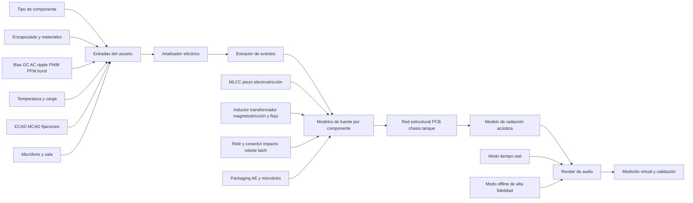
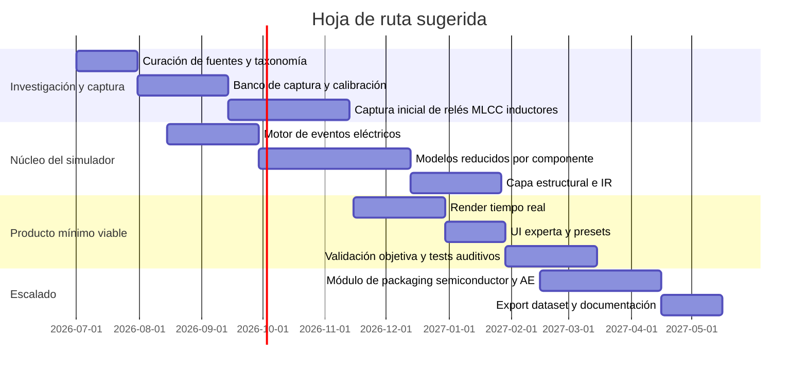

# Simulación de los sonidos producidos por componentes electrónicos y sus combinaciones

## Resumen ejecutivo

La evidencia técnica revisada converge en un punto central: los sonidos audibles de circuitos electrónicos rara vez provienen de un “ruido eléctrico” abstracto, y casi siempre aparecen cuando una magnitud eléctrica excita una estructura mecánica que, a su vez, radia sonido al aire. En la práctica, los emisores dominantes son los MLCC por piezoelectricidad/electrostricción, los inductores y transformadores por magnetostricción, fuerzas magnéticas y fuga de flujo, y los relés por impacto mecánico del inducido y rebote de contactos; la PCB, el blindaje, la carcasa o el tanque del transformador suelen actuar como radiadores y amplificadores estructurales. Los resistores comunes y muchos encapsulados semiconductores suelen ser contribuyentes secundarios o indirectos, salvo casos de potencia, cableado interno o degradación del encapsulado. citeturn20view0turn23view0turn24view0turn26view0turn29view0turn31view0turn36view1

También hay un patrón temporal claro: en convertidores conmutados el tono audible no suele coincidir con la frecuencia de conmutación principal, que a menudo está en decenas o centenas de kHz o en MHz, sino con envolventes, saltos de pulsos, PFM, burst mode, PWM de atenuación, variaciones de carga y coincidencias con modos estructurales de la placa o del conjunto. Por eso un inductor con una portadora de 500 kHz puede “cantar” a 200 Hz, 2 kHz u 8 kHz, y un MLCC montado en una PCB puede ser casi inaudible en aislamiento pero claramente audible cuando la placa entra en resonancia. citeturn24view0turn26view0turn20view0turn40view1

En términos cuantitativos, la literatura primaria ofrece varios anclajes útiles. Murata indica que la vibración propia asociada a ruido acústico en MLCC puede estar en el rango de 1 pm a 1 nm; TI y Murata sitúan la audibilidad cuando la excitación cae entre 20 Hz y 20 kHz; Omron publica distribuciones de presión sonora para relés de baja sonoridad alrededor de ~36–56 dB medidos a 15 cm; TDK reporta para ciertos inductores blindados niveles de ~30–50 dB en amplios tramos de frecuencia audible y mejoras cercanas a 20 dB de pico con inductores moldeados metálicos; y NEMA normaliza niveles medios admisibles de sonido para grandes transformadores sumergidos en aceite entre 57 y 91 dB, según potencia y clase. citeturn23view0turn20view0turn22view0turn32view0turn26view0turn29view1

Para simulación, el enfoque más robusto no es puramente sample-based ni puramente de elementos finitos. La mejor arquitectura para un simulador útil de ingeniería y audio es híbrida: extracción de eventos eléctricos y modos de operación, modelos físicos o reducidos por componente, red estructural de acoplamiento PCB/chasis, y una capa de renderizado de audio que combine síntesis modal/espectral, transitorios muestreados y convolución de respuestas impulsionales. Ese enfoque permite equilibrio entre realismo, control paramétrico, costo computacional y capacidad de extrapolar a configuraciones nuevas. citeturn19search0turn29view0turn17search10turn17search15turn17search4turn18search2turn18search17

A la vez, el estado del arte en datos es incompleto. Entre las fuentes revisadas no aparece un corpus abierto, ampliamente adoptado y etiquetado a nivel de componente para MLCC, inductor, relé, conector y encapsulado semiconductor. Lo que sí existe son: materiales primarios de fabricantes con mecanismos y ensayos, corpus generales de eventos sonoros como AudioSet, FSD50K y ESC-50, y grabaciones de campo de alta calidad o licencias abiertas que deben curarse a mano. En consecuencia, el simulador debería nacer junto con una campaña de captura propia y un protocolo de validación vibroacústica. citeturn43view0turn43view1turn43view2turn22view0turn43view3

## Mecanismos físicos y firmas sonoras por componente

Conviene separar tres capas: **fuente mecánica**, **camino estructural** y **radiador acústico**. En un MLCC, la fuente mecánica es la deformación ferroeléctrica del chip; el camino es la soldadura y la PCB; y el radiador efectivo suele ser la propia placa. En un transformador, la fuente mecánica puede estar en el núcleo o el devanado, pero el radiador final suele ser el tanque. En un relé, el mecanismo audible dominante ya es el propio impacto mecánico del actuador y, por tanto, el acoplamiento estructural es menos ambiguo. citeturn20view0turn22view0turn29view0turn26view0

### Comparativa de componentes

| Componente | Mecanismo físico principal | Rango audible y firma temporal típicos | Amplitud o referencia útil | Observaciones para simulación | Fuente |
|---|---|---|---|---|---|
| **Resistores fijos** | En la bibliografía revisada, el “ruido” de resistor es ante todo **eléctrico**: térmico y de corriente; en wirewound aparecen además parasitismos de bobinado e interacción mecánica/ térmica. Los resistores wirewound tienen peor comportamiento HF por la inductancia del devanado. | No se reporta un rango audible estándar como radiador aéreo autónomo. En práctica de simulación conviene tratarlos como **fuentes débiles**, mayormente transitorias o dependientes de montaje, salvo resistores bobinados/de potencia. | No se identificó un SPL general reproducible en fuentes primarias para resistores comunes. | Modelar como contribución secundaria: “ticks” térmicos, zumbidos débiles dependientes de montaje o ausencia total. | citeturn47view0turn47view1 |
| **MLCC** | Piezoelectricidad/electrostricción en dieléctricos ferroeléctricos, especialmente BaTiO3; la vibración del chip se transmite a la PCB. | Audible cuando la excitación cae entre **20 Hz y 20 kHz**; común en PFM, PWM de backlight, modos sleep/standby, líneas de batería y transitorios rápidos. Temporalmente aparece como zumbido tonal, trinos modulados o tonos que siguen la carga. | Murata indica amplitudes de vibración del orden de **1 pm a 1 nm**; TI reporta ensayos alrededor de **40–50 dB** en su ejemplo de variación de slew rate. | Son excelentes candidatos a modelo físico reducido + resonancia de PCB. Tamaño, K dieléctrica, número de capas, dV/dt y montaje cambian mucho el resultado. | citeturn23view0turn20view0turn21view2turn22view0 |
| **Capacitores de película** | Vibración mecánica de las películas por **fuerza de Coulomb** entre electrodos de polaridad opuesta; con AC distorsionado o armónicos altos el zumbido empeora. | Firma típica de **buzz** o zumbido sincronizado con AC y armónicos. | TDK no da SPL general, pero sí confirma el mecanismo y que la distorsión/armónicos altos lo intensifican. | Útiles para modelado procedural tonal-harmónico. En alta tensión también hay que separar el caso normal del caso de **corona**, que ya es un modo degradado/destructivo. | citeturn27view0turn28view0 |
| **Relés** | Impacto del inducido, rebote de contactos, flexión del armazón/envolvente. En contactores con PWM de bobina también puede haber zumbido de la bobina. | **Clicks** de milisegundos con cola mecánica corta; en modelos Omron se publican tiempos de operación/liberación del orden de **5–20 ms**, según variante. | Omron publica distribuciones de presión sonora de aproximadamente **36–56 dB(A)**, con medición a **15 cm** y ruido de fondo ~30 dB máx. | Para audio, un buen modelo mezcla transitorio de impacto, rebote y resonancia corta. Para relés/contactores con ahorro PWM, el espectro depende del driver de bobina. | citeturn31view0turn32view0turn33search4turn35view0 |
| **Inductores** | Magnetostricción del núcleo, atracción entre partes magnetizadas, vibración del devanado por fuga de flujo/Laplace-Lorentz, y amplificación por resonancias. | La portadora suele estar en **75 kHz–2.5 MHz** o “varios cientos de kHz a varios MHz”, pero la audibilidad aparece por **burst mode**, **pulse skipping**, **PFM**, **PWM dimming ~200 Hz**, cambios de carga y coincidencia con modos mecánicos; la zona más molesta para el oído está entre **2 y 8 kHz**. | TDK reporta en ciertos ejemplos de inductores blindados sonidos de **~30–50 dB** en banda amplia y mejoras del orden de **~20 dB** de pico con tipos moldeados metálicos; WE añade tablas de magnetostricción de materiales. | Son la familia más apta para un híbrido entre síntesis tonal/modal y modelo físico reducido. La resonancia del conjunto suele ser decisiva. | citeturn24view0turn25view1turn25view2turn25view3turn26view0 |
| **Transformadores** | En vacío domina la **magnetostricción del núcleo**; bajo carga dominan también las **vibraciones de devanados**. | Hum continuo con armónicos; en red de 50 Hz suele destacarse **100 Hz** y armónicos superiores; ABB muestra contenido armónico hasta al menos **1.4 kHz**. | NEMA fija niveles medios de sonido para muchos transformadores sumergidos en aceite entre **57 y 91 dB** según clase y kVA equivalentes. | Para simulación audible, el esqueleto debe ser armónico y dependiente de carga. Los detalles finos vienen del tanque, montaje y acoplamiento fluido-estructura. | citeturn29view0turn30view2turn29view1turn30view3turn30view4turn8search0 |
| **PCB** | Normalmente no es fuente primaria, sino **radiador estructural** y amplificador modal. | El espectro audible depende de los modos de la placa; WE da un ejemplo ilustrativo de coincidencia alrededor de **8 kHz**. | En un SSD de ejemplo, optimizar ubicación y orientación de MLCC redujo el nivel global de potencia sonora **4.59 dB** para un MLCC y **6.04 dB** para múltiples MLCC. | Debe modelarse como red modal o FRF, no como simple “ganancia”. Grosor, fijación, borde, apilado y masa importan mucho. | citeturn21view2turn25view2turn40view1 |
| **Conectores** | Click de enclavamiento al acoplar; en servicio, micro-movimientos/fretting pueden degradar contacto y generar fenómenos de rattle o crackle dependientes de vibración. | El evento dominante es el **click breve de enganche**; para operación continua, el sonido audible no suele ser diseñado ni estable. | TE y Molex describen explícitamente un **audible click** como confirmación de acoplamiento; Fraunhofer IDMT usa el sonido del click para verificación automatizada. | Modelar dos familias: click de inserción y micro-rattle/artefacto por vibración o mal acoplamiento. | citeturn5search3turn5search7turn5search10turn43view3turn5search0turn5search18 |
| **Encapsulados semiconductores comunes** | En fuentes revisadas, el fenómeno dominante no es sonido aéreo audible estable sino **acoustic emission** ultrasónica/estructural por switching, power cycling y daño del packaging. | Señales elásticas de **0.1–1 MHz** en estudios de AE; en audio final conviene traducirlas a transitorios sutiles y no a tonos sostenidos. | Los modos de fallo más citados son **bond wire lift-off**, **delaminación** y **grietas de die attach/substrato**. | En simulación audible, tratarlos como una capa de microeventos ligada a switching/temperatura/aging, no como “altavoces”. | citeturn36view1turn37view1turn45view0 |

### Qué cambia entre componentes similares

El caso de los MLCC muestra bien por qué no basta con saber “qué componente es”. TI y Murata destacan que el tamaño del encapsulado, la constante dieléctrica, el número de capas, el voltaje de línea, la ondulación y el modo de operación alteran de forma fuerte la sonoridad. Murata añade que, en líneas de batería de portátiles, son especialmente problemáticos los modos sleep, standby, PWM de retroiluminación e intermitencia bajo carga, y que el efecto mejora al reemplazar todos los capacitores relevantes de la misma línea, no sólo algunos. citeturn20view0turn22view0

En inductores ocurre algo análogo pero más complejo. TDK enumera tres fuentes de vibración —magnetostricción, atracción por magnetización y vibración del devanado por fuga de flujo— y tres mecanismos de amplificación —contacto con otros componentes, excitación de cuerpos magnéticos cercanos y coincidencia con frecuencias naturales del conjunto—. Würth añade que el material del núcleo importa: la magnetostricción cambia entre ferritas y polvos metálicos, y por eso seleccionar material, tamaño, blindaje y frecuencia del driver puede alterar drásticamente el resultado audible. citeturn26view0turn25view3

## Cómo cambian los sonidos cuando el circuito opera en conjunto

La regla práctica más importante es que el sonido audible de un sistema electrónico es un problema de **multiplicación entre excitación, transferencia estructural y radiación**. Si una excitación mecánica débil cae fuera de los modos de la PCB o del tanque, puede ser inaudible; si coincide con una resonancia mecánica o si varios componentes excitan en fase la misma estructura, el mismo circuito puede pasar a resultar claramente audible. TI muestra que la disposición simétrica de capacitores a ambos lados de la PCB puede cancelar vibración, y el trabajo de 2024 sobre ubicación/dirección de MLCC confirma experimentalmente que sólo mover y orientar los MLCC reduce la potencia sonora radiada varios dB. citeturn21view2turn40view1

El sesgo DC también importa. En MLCC, la identificación de propiedades electromecánicas reporta que el componente electrostrictivo puede superar al piezoeléctrico salvo cerca de cero campo DC, lo que implica que el punto de polarización altera no sólo la capacitancia útil, sino también la fuerza mecánica efectiva con la que el componente excita la placa. Para simulación, eso significa que no basta con una onda AC “abstracta”: hay que parametrizar **DC bias**, amplitud AC y tasa de cambio. citeturn19search0

Las envolventes y modos de control son, con frecuencia, más importantes que la frecuencia de switching nominal. Würth y TDK coinciden en que la conmutación base de muchos convertidores está fuera del rango audible, pero la sonoridad aparece cuando el regulador entra en burst mode, pulse skipping, PFM o PWM de atenuación. TE Connectivity añade, para contactores con PWM de bobina, que operar por encima de **15 kHz** suele bastar para evitar ruido audible parásito de la bobina. En otras palabras: un simulador debe modelar **carrier**, **envelope** y **modulación de eventos**, no sólo la frecuencia instantánea del semiconductor. citeturn24view0turn25view1turn26view0turn35view0

Los efectos térmicos no son una capa “secundaria”. En relés/contactores, TE formula el duty necesario de economización usando la resistencia de bobina a temperatura **R(T)**, lo que altera fuerza de sujeción y, por extensión, el riesgo de zumbido o cambio del transitorio de apertura. En transformadores, la medición acústica depende del medio y de la estructura; en módulos de potencia, los estudios de acoustic emission muestran que el envejecimiento por ciclos térmicos se expresa precisamente como eventos elásticos ligados a grietas, delaminación y lift-off. Esto sugiere que un simulador serio debe tener un estado térmico interno, aunque sea reducido. citeturn35view0turn29view0turn36view1turn45view0

Para componentes mutuamente acoplados, la literatura sugiere tres patrones recurrentes. Primero, **suma coherente**: varios MLCC de una misma línea o varios devanados que excitan el mismo modo estructural. Segundo, **cancelación**: montaje simétrico o excitaciones opuestas que reducen la radiación. Tercero, **desplazamiento modal**: cambiar grosor de PCB, masa del componente, tipo de blindaje o sujeción mueve la resonancia y cambia el color tímbrico percibido más que el nivel total. citeturn21view2turn22view0turn26view0turn29view0

## Grabaciones, datasets y fuentes recomendadas

La revisión de fuentes disponibles muestra una carencia clara: no se identifica un dataset abierto y estándar centrado específicamente en **sonidos de componentes electrónicos** etiquetados por mecanismo, componente, encapsulado, montaje y modo de operación. Los recursos más valiosos hoy se reparten entre documentación de fabricantes, artículos académicos, datasets generales de eventos sonoros y grabaciones de campo abiertas que requieren curación manual. citeturn43view0turn43view1turn43view2turn22view0

### Prioridad recomendada de fuentes

| Prioridad | Recurso | Qué aporta | Fortalezas | Limitaciones |
|---|---|---|---|---|
| Alta | Murata, TI, TDK, Würth, Omron, TE, ABB, NEMA | Mecanismos físicos, mediciones, gráficos, prácticas de mitigación, condiciones de ensayo | Son fuentes primarias u oficiales; útiles para parametrizar el simulador | A menudo no incluyen audio descargable ni corpus etiquetado completo |
| Alta | Artículos sobre MLCC/PCB y vibroacústica de transformadores | Modelos de acoplamiento físico, reducción de ruido y metodologías experimentales | Mejor base para modelos físicos/reducidos | Algunas fuentes tienen acceso parcial |
| Media | AudioSet y FSD50K | Preentrenamiento y recuperación débilmente supervisada de sonidos de buzz, hum, click, etc. | Escala muy grande; FSD50K es abierto y distribuible | No están etiquetados a nivel de componente electrónico con precisión de ingeniería |
| Media | ESC-50 | Benchmark compacto para clasificación ambiental y prototipos rápidos | Fácil de usar | Muy pequeño y poco específico para electrónica |
| Media | Freesound y Wikimedia Commons | Grabaciones de campo y muestras útiles para prototipos sample-based | Licencias abiertas frecuentes; gran variedad | Curación irregular; etiquetas no siempre fiables; mezcla de sonidos EM captados por pickup y sonido aéreo |
| Alta para conectores | Fraunhofer IDMT sobre “correct click” | Caso de uso muy cercano a conectores y clasificación por audio | Relevancia industrial directa | No es un corpus abierto extenso |

Fuentes: citeturn22view0turn20view0turn26view0turn24view0turn32view0turn35view0turn29view0turn29view1turn40view1turn43view0turn43view1turn43view2turn43view3turn44search1turn44search2turn44search18

### Grabaciones y ejemplos representativos

Como enlaces representativos para escucha o inspección, son especialmente útiles los recursos oficiales y de laboratorio que explican mecanismos y, cuando es posible, adjuntan material audiovisual. Murata mantiene artículos y una playlist técnica con contenido sobre **acoustic noise reduction** en capacitores; Fraunhofer IDMT presenta el caso del **click correcto** de conectores; Wikimedia Commons aloja una grabación abierta de **interlocking por relés**, valiosa como ejemplo de texturas de bancos de relés; y Freesound contiene varias grabaciones abiertas de campos electromagnéticos y ruidos electrónicos que, aunque no sustituyen capturas anecoicas, sirven para diseño sonoro y prototipos sample-based. citeturn41search12turn43view3turn44search2turn44search1turn44search18

Mi recomendación práctica es dividir la futura librería de audio en tres grupos. El primero, **golden references** oficiales y de laboratorio, para anclar parámetros. El segundo, **field recordings curadas**, para diversidad perceptual y “cola” de realismo. El tercero, **capturas propias con instrumentación sincronizada**, que serán las únicas realmente suficientes para entrenamiento supervisado por componente, montaje y modo de operación. citeturn22view0turn29view0turn43view1

## Evaluación de enfoques de síntesis y modelado

Para esta familia de sonidos, ningún método aislado domina todo el espacio de diseño. La elección depende de si el objetivo principal es **realismo perceptual**, **explicabilidad física**, **control paramétrico**, **tiempo real** o **capacidad de extrapolación** a diseños no medidos. citeturn19search0turn29view0turn17search10turn18search2

### Comparativa de enfoques

| Enfoque | Realismo potencial | Costo computacional | Parámetros controlables | Ventajas | Desventajas | Mejor uso |
|---|---|---:|---|---|---|---|
| **Sample-based** | Muy alto para casos vistos | Bajo en CPU, medio/alto en memoria | Ganancia, pitch, time-stretch, crossfades, selección contextual | El camino más corto a un demo convincente; ideal para clicks de relés y conectores | Extrapola mal a nuevas geometrías y modos eléctricos; difícil separar mecanismo y radiador | Relés, conectores, bibliotecas de transitorios, prototipos UX |
| **Modelado físico completo** | Muy alto si el modelo está bien calibrado | Muy alto; normalmente offline | Materiales, geometría, sesgo DC, corrientes, límites mecánicos, fijaciones | Explicable, extrapolable, útil para diseño y mitigación | Coste alto, parametrización difícil, dependencia de datos materiales | MLCC+PCB, transformadores, inductores críticos, estudios de sensibilidad |
| **Modelo físico reducido** | Alto | Medio | Fuerza equivalente, FRF/modalidad, damping, modos de control | Mucho mejor compromiso que FEM completo | Pierde detalle local | Núcleo del simulador de producción |
| **Additive / spectral modeling** | Alto para hums, whines y estructuras cuasi-armónicas | Bajo/medio | Frecuencias parciales, amplitudes, sidebands, ruido residual | Excelente control; muy útil para transformadores e inductores | Requiere análisis previo y puede sonar “demasiado limpio” sin capa residual | Hums de transformador, coil whine, tonos PFM |
| **FM** | Medio/alto para tonos ricos y sidebands | Bajo | Índice de modulación, portadora, moduladora, envolventes | Chowning mostró su eficiencia y simplicidad relativa frente a additive para espectros complejos | Menos transparente físicamente | Coil whine estilizado, exploración rápida de sidebands |
| **Granular** | Medio/alto para texturas irregulares, glitches y microeventos | Medio | Densidad de granos, duración, jitter, dispersión espectral | Muy útil para sonidos intermitentes y superficies de ruido | Puede perder identidad física si se usa sin restricciones | Packaging AE reescalado, crujidos, rizados irregulares |
| **Convolución** | Alto para transferencias estructurales y radiación | Medio/alto; particionada si es tiempo real | IR estructural, IR de caja, acústica de carcasa | Excelente para añadir “la firma del montaje” | No genera la fuente; sólo la transforma | Paso PCB/chasis/tanque/caja |
| **Híbrido** | El mejor compromiso global | Medio/alto | Todos los anteriores, organizados por capas | Realista, controlable y trasladable a tiempo real/offline | Más complejo de implementar | Simulador de producto y herramienta de I+D |

Base técnica: el modelado físico del audio virtual está bien establecido en procesamiento físico de audio; la síntesis espectral separa componentes sinusoidales y residuales; la FM ofrece un control temporal de ancho de banda especialmente eficiente; la síntesis granular es flexible y expresiva en tiempo real; y la convolución particionada es el estándar práctico para IR largas con baja latencia. citeturn17search10turn17search15turn17search23turn17search4turn17search8turn17search1turn18search2turn18search17

### Recomendación metodológica concreta

Para **MLCC y PCB**, lo recomendable es un modelo físico reducido: estimar una fuerza equivalente o una familia modal dependiente de sesgo, ripple y orientación, y después radiarla a través de la FRF/modalidad de la PCB. El trabajo de optimización de ubicación/dirección y la literatura de simulación de singing capacitors apuntan justamente a esa estrategia. citeturn40view1turn19search0

Para **inductores y transformadores**, conviene un esqueleto **modal-espectral** con armónicos, sidebands y resonancias dependientes de carga, más una capa opcional de convolución estructural. Cuando se necesite trazabilidad mecánica, el modelo debe poder retroceder a un bloque físico reducido o FEM/BEM en offline. citeturn29view0turn26view0turn24view0turn19search15

Para **relés, conectores y eventos de encapsulado**, la mejor relación costo/beneficio suele venir de un enfoque **sample-based + modal corto**: muestra transitoria de ataque, submuestras de rebote o multisample por variante, y una resonancia final sintetizada para que el mismo evento pueda adaptarse a distancia, carcasa y montaje. citeturn32view0turn43view3turn36view1

## Arquitectura propuesta del simulador

La arquitectura recomendada debe aceptar entradas eléctricas, geométricas, térmicas y de montaje, y separar explícitamente **modelo de fuente**, **modelo estructural** y **modelo acústico/render**. Esa separación reproduce fielmente lo que muestran TI, Murata, TDK y ABB: la mayor parte del “carácter” audible aparece al pasar de la excitación local al radiador estructural. citeturn20view0turn22view0turn26view0turn29view0

### Arquitectura de señal y simulación

### Parámetros de entrada mínimos

| Grupo | Parámetros recomendados | Justificación |
|---|---|---|
| Eléctricos | V, I, ripple, dV/dt, dI/dt, frecuencia de switching, modo PWM/PFM/burst/pulse skipping, duty, carga, transitorios | Son los determinantes principales de la excitación audible en MLCC, inductores y contactores. citeturn21view2turn25view1turn26view0turn35view0 |
| Componente | Tecnología, tamaño, material del núcleo/dieléctrico, número de capas o espiras útiles, tipo de blindaje, masa | Murata, TDK y Würth muestran dependencia fuerte con material y geometría. citeturn23view0turn25view3turn26view0 |
| Estructurales | Posición y orientación en PCB, apilado, grosor, puntos de fijación, carcasa, tanque o blindajes cercanos | Impactan la resonancia y la radiación. citeturn21view2turn40view1turn29view0 |
| Térmicos | Temperatura de bobina, de PCB, de encapsulado, historial térmico y ciclos | Cambian R(T), amortiguamiento, modos y envejecimiento. citeturn35view0turn36view1turn45view0 |
| Acústicos | Distancia del oyente/micrófono, tipo de micrófono, campo libre/difuso/presión, IR de caja o sala | Son necesarios para convertir vibración en escucha realista y medible. citeturn42view0turn42view2 |

### Captura de dataset y sensórica

La campaña de captura debería combinar al menos **micrófono de medida**, **medición de vibración estructural**, **instrumentación eléctrica** y **telemetría térmica**. Murata recomienda medir SPL en caja anecoica, más FFT y medición de ondulación; ABB usa LDV y sound intensity scanning para correlacionar vibración y radiación; y en encapsulados semiconductores la literatura de AE emplea sensores piezoeléctricos de banda ancha montados sobre el sustrato o el módulo. citeturn22view0turn29view0turn36view1turn45view0

| Sensor | Rol | Recomendación |
|---|---|---|
| Micrófono de medida clase 1 | SPL, espectro audible, validación subjetiva/objetiva | Calibración a **94/114 dB a 1 kHz** antes y después de sesión. citeturn42view0 |
| Micrófono 1/2" o 1/4" según banda | Captura HF audible y control de error por tipo de campo | Brüel & Kjær advierte que usar el tipo de micrófono equivocado y un campo mal caracterizado puede introducir errores grandes, incluso >10 dB a 20 kHz. citeturn42view2 |
| LDV o acelerómetro PCB | Modos estructurales, FRF, localización de fuentes | Muy valioso para MLCC e inductores sobre placa. citeturn29view0 |
| Sonda de corriente y sonda diferencial de tensión | Sincronizar excitación mecánica con el circuito | Necesario para extraer envolventes y sidebands causales. citeturn22view0turn26view0 |
| Termopares / IR | Estado térmico y derivas paramétricas | Necesario para relés/contactores y módulos de potencia. citeturn35view0turn45view0 |
| Sensor AE piezoeléctrico | Eventos ultrasónicos/estructurales de packaging | Obligatorio si se quieren modelar encapsulados y degradación. citeturn36view1turn45view0 |

### Calibración y validación

En un banco de captura, yo recomendaría usar una jerarquía de validación en cuatro niveles. Primero, **eléctrico**: verificar que eventos y modos de control correspondan a las condiciones suscitantivas del sonido. Segundo, **mecánico**: comparar modos y velocidades/acceleraciones en PCB o tanque. Tercero, **acústico**: comparar SPL, 1/3 de octava, picos tonales, sidebands y envolvente temporal. Cuarto, **perceptual**: pruebas ABX o MUSHRA con expertos para decidir si el simulador reproduce no sólo el nivel, sino el carácter del sonido. La propia literatura revisada ya usa SPL, FFT, LDV, sound intensity y AE como niveles complementarios de evidencia. citeturn22view0turn29view0turn32view0turn36view1

### Tiempo real frente a offline

| Modo | Objetivo | Método recomendado | Latencia objetivo | Uso |
|---|---|---|---:|---|
| **Tiempo real** | Audición interactiva, UX, debugging de coil whine/relay clicks | Modelos reducidos + sample-based + convolución particionada corta | 5–20 ms | Integración en DAW, plugin, herramienta interna |
| **Offline** | Verificación de diseño, exploración de sensibilidad, export master | FEM/BEM o ROM con análisis modal y render de alta resolución | No crítico | Ingeniería, documentación, generación de dataset |
| **Mixto** | Iteración rápida y refinado posterior | Tiempo real para sketch; offline para recalibración | Híbrido | Flujo de desarrollo más eficiente |

La razón técnica para esta división es clara: las IR largas y la auralización de alta fidelidad pueden ejecutarse en tiempo real con convolución particionada, pero la simulación electromecánica detallada y el barrido paramétrico completo siguen siendo, en la práctica, tareas más apropiadas para offline. citeturn18search2turn18search17turn19search15

## Flujos de trabajo, visualizaciones y hoja de ruta

### Flujos de trabajo ejemplo

**Flujo A: MLCC en convertidor de portátil.** Se importan el rail, el modo de control y la capa ECAD. El sistema detecta transitorios y modos PFM/PWM relevantes, estima la fuerza equivalente de cada MLCC, propaga a través de la FRF de la PCB y produce un render con opción de comparar “MLCC estándar”, “interposer” y “metal terminal”. Este flujo está directamente alineado con las medidas de TI, Murata y la literatura reciente sobre ubicación/orientación de MLCC en PCB. citeturn20view0turn21view1turn22view0turn40view1

**Flujo B: inductor de buck con coil whine.** La herramienta toma el switching nominal, identifica burst mode, pulse skipping o PFM, sintetiza la estructura armónica/modulada de la fuerza magnética, la filtra con el conjunto núcleo-bobina-placa y permite conmutar materiales de núcleo, blindaje y tamaño. Este flujo debe mostrar de inmediato por qué un diseño con portadora ultrasónica sigue generando un componente audible. citeturn25view1turn25view2turn25view3turn26view0

**Flujo C: relé/conector/packaging.** Relés y conectores pueden tratarse como bancos de transitorios etiquetados por geometría, distancia y estado. Los encapsulados semiconductores añadirían una pista de microeventos dependiente de switching, ciclo térmico y degradación, con salida visible tanto en audio audible reescalado como en canal AE de diagnóstico. citeturn32view0turn43view3turn36view1turn45view0

### Visualizaciones recomendadas

| Visualización | Qué revela | Utilidad |
|---|---|---|
| Espectrograma sincronizado con tensión/corriente | Sidebands, burst packets, PFM, clicks | Para depuración causal |
| Mapa modal de PCB o tanque | Qué zonas irradian más | Para mitigación mecánica |
| Waterfall de 1/3 octava frente a carga/temperatura | Deriva del timbre y del nivel con operación | Para validación robusta |
| Histograma de SPL transitorio | Distribución de clicks de relés/conectores | Para sample libraries y QA |
| Diagrama de Sankey de energía | Eléctrico → mecánico → acústico | Para narrativa técnica del simulador |
| Panel AB comparativo | Antes/después de cambiar material, orientación o driver | Para toma de decisiones de diseño |

Estas visualizaciones no son un lujo; reflejan exactamente las técnicas empleadas en las fuentes revisadas: FFT/SPL en Murata y TI, mapas de intensidad y medición modal en ABB, distribuciones de presión sonora en Omron y análisis espectral en estudios de AE. citeturn22view0turn21view2turn29view0turn32view0turn45view0

### Hitos y esfuerzo estimado

El esfuerzo siguiente es una estimación de ingeniería, no un presupuesto cerrado. Asume un equipo pequeño con perfiles de DSP/audio, simulación física y validación de laboratorio.

| Hito | Entregable | Esfuerzo aproximado |
|---|---|---:|
| Taxonomía y protocolo | Ontología componente-mecanismo-montaje-modo | 3–4 semanas |
| Banco de captura | Caja de ensayo, sincronía, calibración, scripts | 5–7 semanas |
| Dataset inicial | 200–500 eventos limpios + trazas eléctricas/vibracionales | 6–8 semanas |
| MVP de síntesis | MLCC, inductor, relé, transformador básico | 10–14 semanas |
| Validación | Métricas + primeras pruebas ABX/MUSHRA | 4–6 semanas |
| Versión avanzada | Conectores, packaging AE, importación ECAD/MCAD parcial | 8–12 semanas |

### Recomendación final de implementación

Si el objetivo es un simulador realmente útil, yo no empezaría por FEM completo. Empezaría por un **MVP híbrido** con cuatro familias bien priorizadas: **relés**, **MLCC**, **inductores** y **transformadores**. Los relés dan resultados perceptualmente convincentes muy pronto. Los MLCC y los inductores cubren gran parte del problema real en electrónica de consumo y potencia. Los transformadores aportan una clase de sonido armónico bien caracterizada y fácil de validar con normativa. Los conectores y el packaging semiconductor deberían entrar en una segunda fase, porque su valor es alto, pero el dato abierto es significativamente más escaso y la captura requiere instrumentación y curación más especializadas. citeturn32view0turn22view0turn26view0turn29view0turn43view0turn43view1

En resumen: el simulador ideal para este dominio no es un simple “sintetizador de buzz”. Debe ser una herramienta de **audio + vibroacústica + electrónica de potencia**, capaz de explicar por qué un diseño suena, qué cambiaría si cambian el driver, el material, el encapsulado o la PCB, y cómo convertir ese conocimiento en audio realista en tiempo real y en predicción útil offline. Esa combinación es, precisamente, la que mejor reflejan las fuentes técnicas revisadas. citeturn20view0turn22view0turn24view0turn26view0turn29view0turn40view1